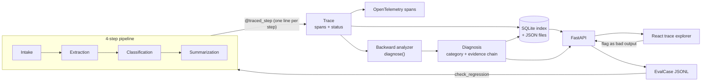

# Failure Forensics

Observability and root-cause analysis for multi-step AI pipelines. It runs a document through a 4-step LLM pipeline, traces every step the way a real observability stack would, mechanically diagnoses *why* a run went wrong, and turns confirmed failures into a growing regression test suite.

The pitch: automated root-cause diagnosis turns a multi-step pipeline failure from an hours-long manual investigation into a sub-second, evidence-backed answer.

## Architecture



A run produces a `Trace` (one `Span` per step: input, prompt, output, raw response, confidence, latency). The backward analyzer walks a failed or degraded trace from its last span toward its first and stops at the first step whose own output doesn't hold up against its own input -- that's the root cause. A human confirming a diagnosis in the UI freezes it into an `EvalCase`, replayable later to check whether it's fixed, still failing the same way, or failing differently.

## Failure taxonomy

| Category | Where it's caught | Mechanism |
|---|---|---|
| Extraction hallucination | Extraction | `source_quote` doesn't appear in the document -- a substring check, not a judgement call |
| Misclassification | Classification | Top and runner-up category scores are within 20% of each other |
| Context loss | Summarization | A high-confidence, grounded fact from extraction never appears in the final summary |
| Prompt failure | Any LLM step | The model's response doesn't parse as the JSON the step asked for |
| Propagation error | Any LLM step | That step's self-reported confidence drops sharply from the step before it, with no other category already explaining it |

## Tech stack

| Component | Choice |
|---|---|
| Language | Python 3.11+ |
| Pipeline | Custom 4-step chain, Pydantic models at every boundary |
| LLM provider | Groq (OpenAI-compatible; OpenAI/OpenRouter also wired up) |
| Tracing | Custom `Span`/`Trace` models + real OpenTelemetry spans |
| Storage | SQLite index + JSON trace files |
| API | FastAPI |
| Frontend | React (Vite) |
| Containerization | Docker + docker-compose |

## Project layout

```
src/forensics/
  pipeline/        intake, extraction, classification, summarization, runner, tracing
  models.py        every typed value that crosses a step boundary (Document, Trace, Diagnosis, ...)
  tracing.py       @traced_step decorator + RecordingLLMClient (Phase 2)
  otel.py          OpenTelemetry span wiring, opt-in via FF_OTEL_EXPORTER
  analysis.py      diagnose() -- the backward root-cause walk (Phase 3)
  store.py         TraceStore: JSON files + SQLite index
  eval.py          flag_case / EvalDataset / check_regression / failure_analytics (Phase 5)
  api.py           FastAPI app
  llm/             MockLLM, ReplayClient, live OpenAI-compatible client, provider selection
frontend/          React trace explorer (talks to the API)
tests/             one file per module above, plus test_api.py and an opt-in test_live_smoke.py
```

## Running it

### Backend only (mock mode, no API key needed)

```bash
python -m venv .venv && .venv/Scripts/activate   # or source .venv/bin/activate
pip install -e ".[dev]"
pytest
```

### API + React frontend, locally

```bash
uvicorn forensics.api:app --reload            # http://localhost:8000, docs at /docs
cd frontend && npm install && npm run dev     # http://localhost:5173, proxies /api to 8000
```

### Everything, containerized

```bash
docker compose up --build
# API:      http://localhost:8000
# Frontend: http://localhost:8080
```

Trace and eval data live in a named Docker volume (`ff-data`) so they survive container restarts.

### Live mode (a real model instead of the mock)

Copy `.env.example` to `.env`, set `GROQ_API_KEY` (free at [console.groq.com/keys](https://console.groq.com/keys)), and set `FF_LLM_MODE=live`. `scripts/check_provider.py` lists the models your key currently has access to -- model IDs on free tiers get deprecated regularly.

```bash
python scripts/check_provider.py
RUN_LIVE_SMOKE=1 pytest tests/test_live_smoke.py -v
```

## Deploying to Render

Two services, deployed separately from the same repo -- there's no blueprint file for this, since Render's dashboard flow is quick enough for a two-service setup and doesn't risk drifting out of sync with Render's own schema the way a committed `render.yaml` would.

**1. API -- New → Web Service → Docker, connect this repo.**
Root directory: repo root (`Dockerfile` at `./Dockerfile`). Render assigns the port via `$PORT`; the Dockerfile's `CMD` already binds to it.
Env vars: `FF_LLM_MODE=mock` (or `live`, plus `GROQ_API_KEY` and `FF_LLM_PROVIDER=groq`, to hit a real model). Leave `FF_API_CORS_ORIGINS` for step 3.
The free instance type has **no persistent disk** -- trace and eval-case data resets on every restart or redeploy. For the eval set to actually persist, use a paid instance type with a disk mounted at `/data` (matches `FF_TRACE_DIR`/`FF_EVAL_FILE` already set in the Dockerfile).

**2. Frontend -- New → Static Site, same repo.**
Root directory: `frontend`. Build command: `npm install && npm run build`. Publish directory: `dist`.
Env var: `VITE_API_BASE` = the API service's URL from step 1 (e.g. `https://failure-forensics-api.onrender.com`, no trailing slash) -- `api.js` reads this at build time.

**3. Close the loop.**
Back on the API service, set `FF_API_CORS_ORIGINS` to the static site's URL from step 2, and redeploy the API -- otherwise the browser blocks the frontend's requests to it.

Free-tier web services spin down after 15 minutes idle; the first request after a while is a slow cold start, not a broken deploy.

## OpenTelemetry

Off by default (a no-op tracer, zero cost). Set `FF_OTEL_EXPORTER=console` to print spans locally, or `otlp` (with the `otlp` extra installed: `pip install -e ".[otlp]"`) to ship them to a real collector via `OTEL_EXPORTER_OTLP_ENDPOINT`.

## API reference

Full interactive reference at `/docs` once the API is running. Summary:

| Endpoint | Does |
|---|---|
| `POST /runs` | Run a document through the pipeline (`raw_text`, `source_name`, optional `mode` and `chaos`) |
| `GET /runs` | List runs (from the SQLite index) |
| `GET /runs/{trace_id}` | Full trace, every span |
| `GET /runs/{trace_id}/diagnosis` | Root-cause diagnosis, or `null` if the run was clean |
| `POST /runs/{trace_id}/flag` | Confirm a diagnosis (or override its category) into a permanent eval case |
| `GET /eval-cases` | The growing regression-test set |
| `GET /analytics` | Failure counts by category/step, failure rate by day, time-to-diagnosis |
