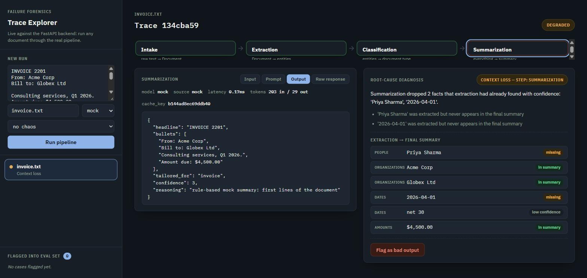
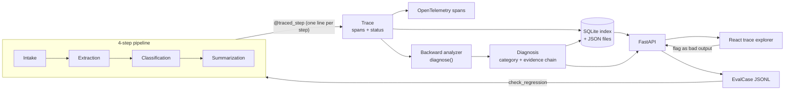

# Failure Forensics

<p align="center">
  <a href="https://github.com/19himanshurane/Failure-Forensic/actions/workflows/tests.yml"></a>
  
  
  
  
  
</p>

<p align="center">
  <a href="https://failure-forensic-ui.onrender.com"><b>Live demo</b></a> &middot;
  <a href="https://failure-forensic.onrender.com/docs"><b>Live API docs</b></a> &middot;
  <a href="#setup">Setup</a> &middot;
  <a href="#try-it-in-2-minutes">Try it in 2 minutes</a> &middot;
  <a href="#how-it-works">Architecture</a>
</p>

**[Try the live trace explorer](https://failure-forensic-ui.onrender.com)**: no setup, no local run. Paste a document, run it through the real pipeline, and watch it get diagnosed.

---

## The problem

A pipeline that chains several LLM calls (extract facts, classify the document, write a summary) fails in ways that are genuinely hard to trace back. An entity invented two steps upstream doesn't announce itself; it just quietly turns into a wrong line in the final summary, and by the time a human notices something's off, the actual mistake is buried under two more layers of processing that all looked fine on their own.

**Failure Forensics** is a pipeline built specifically to make that failure visible. Every step is traced, a backward analyzer walks a bad trace to the exact step that caused it, and confirmed failures get frozen into a regression set so you can tell later whether they're actually fixed.

## What it does

| Stage | What it does |
|---|---|
| Intake | canonicalizes raw text into a content-addressed `Document`, so identical input always gets the same id |
| Extraction | pulls entities with a verbatim source quote attached to each one, so hallucination detection is a substring check, not a judgement call |
| Classification | scores every category independently and derives the confidence margin in Python, instead of asking the model to output a margin it can't actually calibrate |
| Summarization | writes a type-tailored summary from the facts extraction already found |
| Tracing | one `Span` per step (input, prompt, output, confidence, latency), both as custom objects and as real OpenTelemetry spans |
| Root-cause analyzer | walks a failed or degraded trace backward and stops at the first step whose output doesn't hold up against its own input |
| Feedback loop | a confirmed diagnosis freezes into a replayable `EvalCase`, so a later run can be checked against it: fixed, still failing the same way, or failing differently |
| API + frontend | FastAPI backend, React trace explorer, wired together live |

## What it looks like



Every node in the flow strip is clickable down to the actual input, prompt, and raw model response for that step. The diagnosis panel on the right names the step at fault and lists the specific facts involved, not just a status code.

## Setup

```bash
git clone https://github.com/19himanshurane/Failure-Forensic.git
cd Failure-Forensic
python -m venv .venv && source .venv/bin/activate   # Windows: .venv\Scripts\activate
pip install -e ".[dev]"

cp .env.example .env
# Add a free Groq key from console.groq.com to GROQ_API_KEY if you want a
# real model instead of the mock. The mock needs no key at all.
```

## Try it in 2 minutes

```bash
uvicorn forensics.api:app --reload
# -> http://localhost:8000/docs
```

In a second terminal:

```bash
cd frontend && npm install && npm run dev
# -> http://localhost:5173
```

Or run both together:

```bash
docker compose up --build
# API:      http://localhost:8000
# Frontend: http://localhost:8080
```

## How it works



A run produces a `Trace`, made up of one `Span` per step, carrying its input, prompt, output, confidence, and latency. The backward analyzer walks a failed or degraded trace from its last span toward its first and stops at the step whose own output doesn't hold up against its own input. That step is the root cause.

| Category | Where it's caught | Mechanism |
|---|---|---|
| Extraction hallucination | Extraction | `source_quote` doesn't appear in the document |
| Misclassification | Classification | Top and runner-up category scores are within 20% of each other |
| Context loss | Summarization | A high-confidence, grounded fact from extraction never appears in the final summary |
| Prompt failure | Any LLM step | The model's response doesn't parse as the JSON the step asked for |
| Propagation error | Any LLM step | That step's confidence drops sharply from the step before it, with no other category already explaining why |

## API reference

Full interactive reference at [`/docs`](https://failure-forensic.onrender.com/docs) once the API is running. Summary:

| Endpoint | Does |
|---|---|
| `POST /runs` | Run a document through the pipeline (`raw_text`, `source_name`, optional `mode` and `chaos`) |
| `GET /runs` | List runs from the SQLite index |
| `GET /runs/{trace_id}` | Full trace, every span |
| `GET /runs/{trace_id}/diagnosis` | Root-cause diagnosis, or `null` if the run was clean |
| `POST /runs/{trace_id}/flag` | Confirm a diagnosis (or override its category) into a permanent eval case |
| `GET /eval-cases` | The growing regression-test set |
| `GET /analytics` | Failure counts by category and step, failure rate by day, time-to-diagnosis |

## Configuration

Environment variables (see `.env.example`):

| Variable | Purpose |
|---|---|
| `FF_LLM_MODE` | `mock` (default, free, no key), `replay` (cassette playback), or `live` |
| `FF_LLM_PROVIDER` | `groq`, `openai`, or `openrouter` for live mode |
| `GROQ_API_KEY` | free key from console.groq.com; powers live mode |
| `FF_MODEL` | override the default model; `scripts/check_provider.py` lists what your key currently has access to |
| `FF_MOCK_CHAOS` | comma-separated failure injections for testing the detectors: `hallucinate,misclassify,drop_context,bad_json` |
| `FF_OTEL_EXPORTER` | unset (no-op, zero cost), `console`, or `otlp` (needs the `otlp` extra) |
| `FF_TRACE_DIR` / `FF_EVAL_FILE` | where the API persists traces and flagged eval cases |
| `FF_API_CORS_ORIGINS` | comma-separated origins the API will accept requests from |

## Deploying to Render

Two services, deployed separately from the same repo.

**1. Create the API service.** New → Web Service → Docker, connect this repo. Render assigns the port via `$PORT`; the Dockerfile already binds to it. Set `FF_LLM_MODE` (and `GROQ_API_KEY`/`FF_LLM_PROVIDER` for a real model). The free instance type has no persistent disk, so trace and eval-case data resets on every restart; a paid instance with a disk mounted at `/data` fixes that.

**2. Create the frontend.** New → Static Site, same repo. Root directory `frontend`, build command `npm install && npm run build`, publish directory `dist`. Set `VITE_API_BASE` to the API service's URL from step 1.

**3. Close the loop.** Back on the API service, set `FF_API_CORS_ORIGINS` to the static site's URL and redeploy, or the browser blocks the frontend's requests to it.

## Development

```bash
pytest tests/ -v
```

```
src/forensics/
  pipeline/        intake, extraction, classification, summarization, runner, tracing
  models.py        every typed value that crosses a step boundary
  tracing.py       @traced_step decorator + RecordingLLMClient
  otel.py          OpenTelemetry span wiring
  analysis.py      diagnose(): the backward root-cause walk
  store.py         TraceStore: JSON files + SQLite index
  eval.py          flag_case / EvalDataset / check_regression / failure_analytics
  api.py           FastAPI app
  llm/             MockLLM, ReplayClient, live OpenAI-compatible client
frontend/          React trace explorer
tests/             one file per module above, plus test_api.py and an opt-in test_live_smoke.py
```

## Known limitations

- The mock LLM is deliberately crude (rule-based, keeps whatever's in the first few lines of a document for its summary), and that produces real context loss even with no chaos flag set. It's honest, not a bug, and a plain invoice-shaped document can legitimately come back `DEGRADED` under the mock alone.
- Propagation-error detection is a heuristic, a confidence-drop threshold between consecutive steps. It catches the shape of that failure, not a semantic explanation of why the step struggled.
- Groq's free-tier model catalog changes without much warning; a model ID that works today can 404 next month. `scripts/check_provider.py` exists specifically to catch that before a real run does.
- The live deploy runs on Render's free tier. The API spins down after about 15 minutes idle (the first request after that takes up to a minute), and there's no persistent disk, so trace and eval data reset on every restart.
- OpenTelemetry export has only been exercised with the no-op and console exporters; the `otlp` path isn't validated against a real collector in this deploy.

## License

MIT. See [LICENSE](LICENSE).

---

<p align="center">Built so a multi-step pipeline's failures don't stay a mystery: point the backward analyzer at a bad trace and get the actual root cause, with the evidence attached.</p>
